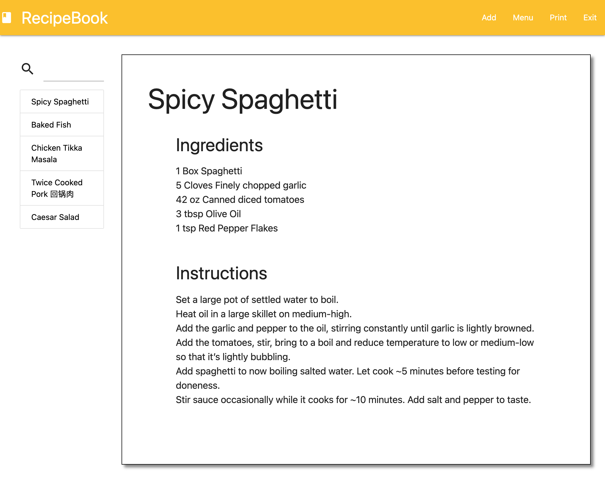

# RecipeBook

  ## Description

  An online recipe book to view sand save your favorite recipes.

  ## Table of Contents

  * [Image](#image)
  * [Technologies](#technologies)
  * [Known-Bugs](#known-bugs)
  * [Next-Steps](#next-steps)
  * [License](#license)
  * [Contact](#contact)
  * [Links](#links)

  ## Image

  

  ## Technologies
  
  * HTML
  * CSS
  * Javascript
  * Node
  * Express
  * Handlebars
  * Eslint
  * Sequelize

  ## Known-Bugs

  Currently working out bugs with viewing public recipes.

  ## Next-Steps

  * Complete search funcitonality.
  * Update and delete recipe routes.
  * Print and sharing options.

  ## License

  This project is licensed under the [MIT](https://opensource.org/licenses/MIT) license.
  

  ## Contact

  ### Authors: Alexander Fok, Kurt Phillips, Ray Luna 

  If you have any questions about the repo, open an issue or contact us directly at:
  - E-Mail: 
    * leon.luna.ray@gmail.com
  - GitHub: 
    * [alex-fok](https://github.com/alex-fok)
    * [kurtp23](https://github.com/kurtp23)
    * [leon-luna-ray](https://github.com/leon-luna-ray)

  ## Links

  - [Deployed Project](https://arcane-peak-55315.herokuapp.com/login) 

  - [Project Repository](https://github.com/kurtp23/recipe-book)

  